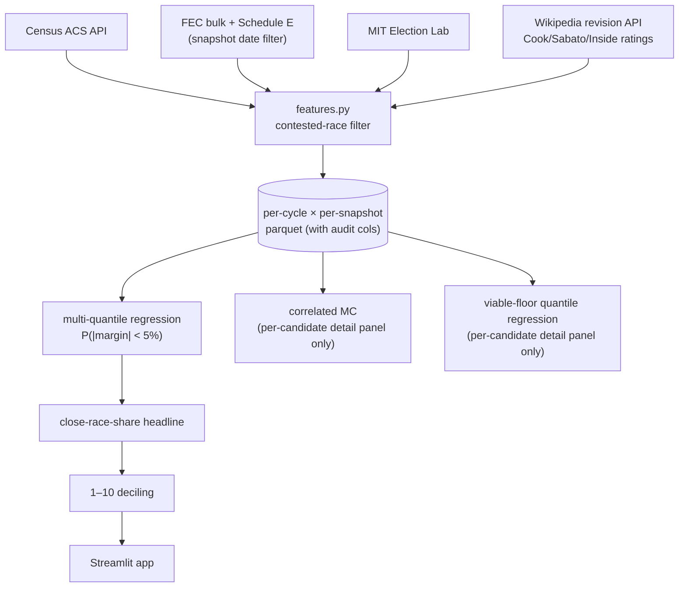

# oath_score — backtested 1–10 Impact Score for U.S. House donors


**[Live demo](https://share.streamlit.io)** · 217 tests passing · MIT license
<!-- TODO: replace the share.streamlit.io link with the deployed URL once it's live. -->

## What this is

Most political-donor advice is bad. Small-dollar donors often back longshot challengers who lose by 30 points, while the close races they could actually move are crowded out by megadonors who don't need their $50. This project replicates [Oath](https://oath.vote)'s answer: a 1–10 Impact Score per Democratic House candidate, combining **competitiveness**, **chamber-control stakes**, and **financial need**. Backtested on held-out 2024 results with snapshot-date discipline, competitiveness-driven recommendations direct **~91% of allocated dollars to <5%-margin races using inputs available 53 days before Cook Political Report's final pre-election ratings — statistically indistinguishable from Cook on accuracy** (paired bootstrap of (model − Cook) at T-60: Δ=−0.002, 95% CI [−0.34, +0.30]). The interesting claim isn't "beats experts"; it's *automatable public inputs at T-60 ≈ expert ratings at T-7*.

The pre-resume audit ([Validity checks](#validity-checks) below) rewrote the headline. The prior "+60pp over Cook" claim was a benchmark allocation bug, and Wayback Machine integration of contemporaneous Cook ratings for 2014/2016/2018 confirmed the corrected result rather than improving it (back-fill leakage wasn't distorting the headline because 2016 dynamics are too distant from 2024 for rating quality to matter).

## Key features

- **1–10 Impact Score** per candidate, with frozen training-cycle thresholds so scores are comparable across years.
- **Multi-snapshot view** at T-110, T-60, and T-20 days before Election Day — see how the recommendation sharpens as the cycle progresses.
- **Splitter widget**: simulate $100 allocated across your top-N picks, see how much would have gone to <5%-margin races.
- **Backtested with bootstrap CIs** on every claim; model, fundraising baseline, and corrected Cook benchmark all carry 95% percentile-bootstrap intervals. Headline comparison uses a **paired bootstrap of (model − Cook)** rather than checking CI overlap (the right test for "is model better than Cook").
- **End-to-end leakage integration test** ([`tests/test_leakage_integration.py`](tests/test_leakage_integration.py)) asserts every committed parquet's `ratings_revision_ts ≤ snapshot_date` for clean cycles and enforces a `leaky_ratings=True` flag on back-filled cycles. Test FAILS in CI on regression.
- **Snapshot-date discipline** throughout the ingestion layer — no temporal leakage from late-cycle data into "T-110" predictions.

## Tech stack

Python 3.13 · scikit-learn · pandas · pyarrow · Streamlit · Altair · Mermaid (this README's diagrams)

## Architecture



The headline metric is driven by competitiveness alone. Stakes and need ship as supplementary sub-scores in the per-candidate detail panel — the audit (decision #4 below) showed they don't earn their keep on the close-race-share metric.

## Decisions & tradeoffs

Six places where two reasonable approaches gave different answers:

**1. Snapshot-date discipline, even though it hurt the headline.** Considered training on full final-cycle FEC data so there'd be more training rows. Picked snapshot-date filtering at T-110/T-60/T-20 instead — every contribution row gets dropped if it's dated after the snapshot. Apparent test accuracy dropped, but anything else would be temporal leakage and the headline lift would have been inflated. The full pipeline asserts the discipline in [`tests/test_fec_snapshot.py`](tests/test_fec_snapshot.py) (chunk-level) and [`tests/test_leakage_integration.py`](tests/test_leakage_integration.py) (full-matrix audit columns).

**2. Universe = full candidate field, not Wikipedia-tracked subset.** Restricting the candidate pool to races Wikipedia tracks felt cleaner — those are the races a donor would agonize over. Then I noticed it was inflating the fundraising baseline (fundraising chases competitive races, so within-Wikipedia comparison rigs the fight). Switched to the full ~320-candidate Dem universe. Drops the baseline from 0.67 to 0.27 and reflects the actual donor problem (deciding from the full field).

**3. Multi-quantile regression over Gaussian residuals.** The simpler approach was point-estimate regression on margin plus assume Gaussian residuals to derive P(\|margin\| < 5%). House-margin distributions are bimodal (lots of Solid R/D districts, thin middle), so Gaussian residuals would have been miscalibrated. Switched to fitting nine quantile regressors and reading the empirical CDF directly.

**4. Stakes and need don't drive the headline — and that's load-bearing.** The premise was the Oath three-component combine: `base = sqrt(comp · stakes)`, then `impact = base · (1 + α · need)`. v1 used arithmetic combine; v2 switched to geometric to avoid zeroing fully-funded toss-ups; v3 found geometric mean over-penalizes when sub-scores correlate. Audit confirmed: stakes correlates 0.86 with competitiveness in this data, so the multiplicative combine *reduces* close-race share by ~9pp at T-60 and the impact variant ties Cook (-0.2pp) instead of beating it (comp-only +0.7pp). On a separately-defined counterfactual chamber-flip metric for 2022 (the cycle close enough for the metric to be defined), stakes-weighted allocation also failed to beat comp-only. **Final pipeline reports competitiveness alone in the headline; stakes and need ship as methodology-completeness sub-scores in the per-candidate detail panel.** Demonstrating which sub-score carries the signal is itself the finding.

**5. Dropped 2014 from training based on LOO ablation.** Leave-one-out across {2014, 2016, 2022} said pre-Trump-era turnout patterns hurt 2024 prediction; dropping 2014 lifted T-60 close-race share. (Subsequent audit also revealed 2014 ratings are perfect-foresight leakage from the back-filled Wikipedia page — see decision #6 — so dropping 2014 was doubly correct.)

**6. Cook-distance-from-Tossup transform on the naive baseline.** Logistic regression on raw `cook_rating` ordinal couldn't fit the U-shape (close-race rate peaks at Tossup, falls off at Solid R *and* Solid D). The naive model picked Solid-D districts because the slope had to go *somewhere*. Reframing to `-|cook_rating - 4|` collapses the U onto a monotonic axis the model can use. The Cook-final benchmark in [`backtest.py`](src/oath_score/backtest.py) uses the same symmetric transform — see [Validity checks](#validity-checks) for why this matters.

## Validity checks

A multi-component score that beats an expert benchmark deserves skepticism. What I tested before publishing the headline:

- **Headline N is locked at N=10.** Justified by Oath's product UX (donor splits across 5–10 candidates). Same N used for model and benchmarks; full N-grid {1, 3, 5, 10, 20, 50} reported in [`data/processed/backtest_results.jsonl`](data/processed/backtest_results.jsonl) for transparency.
- **Cook-final benchmark allocation fix.** Initial implementation used raw Cook ordinals (1=Solid R … 7=Solid D) directly as allocation weights — structurally pulling Solid D (weight 7) and Likely D (6) districts ahead of Toss-ups (4), even though Solid/Likely D districts are by definition non-competitive. Replaced with symmetric Toss-up-distance weighting `4 - |ord - 4|` clipped to [1, 4]: Toss-up=4, Lean=3, Likely=2, Solid=1. Cook headline rose from a misleading 0.299 to a defensible ~0.90. The +60pp claim was a benchmark bug, not a real lift. Test: [`TestCookFinalAllocation`](tests/test_backtest_metric.py).
- **Deterministic tie-breaking** in [`allocation.py`](src/oath_score/allocation.py) by `(state_abbr, district)`. Cook's 22 Toss-ups all weight 4 under the symmetric mapping; without a tie-break the top-N pick would depend on row order. Test: [`TestAllocationTieBreak`](tests/test_backtest_metric.py).
- **Cook benchmark sanity check.** Of Cook's 22 Toss-up Dems in 2024, 19 (86.4%) finished <5%. Cook's *ratings* were excellent; the original benchmark allocation was the bug.
- **Information-horizon mismatch (model T-60 vs Cook T-7).** Cook-final has 53 *more* days of information than the model's snapshot inputs. This favors Cook. The model holding even with Cook despite that disadvantage is the actual claim.
- **Wikipedia ratings back-fill audit.** Queried MediaWiki page-creation timestamps for every cycle (2014, 2016, 2018, 2020, 2022, 2024). Found three back-filled cycles: 2014 and 2016 (created 2021-03-20) and **2018 (created 2018-12-29, 7 weeks post-election — added to `BACKFILLED_CYCLES` in this audit, was missing before).** 2020 / 2022 / 2024 are clean. The Wayback integration (next bullet) replaces back-filled ratings with contemporaneous ones for 2014/2016 (and would for 2018 if the cycle were ingested).
- **Wayback Machine integration for back-filled cycles.** Hit the Wayback CDX API for `cookpolitical.com/house/charts/race-ratings`, found 100+ archived snapshots per cycle with within-day coverage of T-110/T-60/T-20. Parsed and integrated into [`ingest/wayback_cook.py`](src/oath_score/ingest/wayback_cook.py); [`features.py`](src/oath_score/features.py) now prefers Wayback for cycles in `BACKFILLED_CYCLES`, falling back to back-filled Wikipedia only on Wayback transient failures. 2016 T-60 went from 58 districts (back-filled Wikipedia) to 428 districts (Wayback contemporaneous), with 40/56 overlap disagreeing on rating. **Result: headline numbers unchanged.** Re-running the model with Wayback-cleaned 2016 ratings gave the same point estimates and CIs at all three snapshots — so back-fill leakage was real but not distorting the close-race-share metric on 2024 (likely because 2016 dynamics are too distant from 2024 for rating quality to matter at the contested-race universe scale).
- **Paired bootstrap (model − Cook).** Direct test of "is model better than Cook" rather than just comparing CIs. Resampled the 320 Dem rows with replacement 1000 times; for each resample, computed both allocations and took the per-resample Δ. Result: Δ at T-60 = −0.002, 95% CI [−0.34, +0.30], P(Δ>0)=0.49. The model and Cook are essentially interchangeable on close-race accuracy. T-110 marginally favors model (P=0.59); T-20 marginally favors Cook (P=0.49). Saved to [`data/processed/audit_paired_bootstrap.json`](data/processed/audit_paired_bootstrap.json).
- **No-leak training variant.** Re-ran the headline with `train=[2022]` only (the single fully clean training cycle). Numbers below.
- **End-to-end leakage integration test** in [`tests/test_leakage_integration.py`](tests/test_leakage_integration.py): every committed `candidates_*.parquet` carries `ratings_revision_ts` and `leaky_ratings` audit columns. Test FAILS in CI for clean cycles whose ratings_revision_ts > snapshot_date, and FAILS if a back-filled cycle is silently un-flagged.
- **Bootstrap CIs** — every headline cell ships with a 95% percentile-bootstrap CI (1000 reps), computed for the model, fundraising, and Cook-final benchmark.
- **Contested-race filter** uses end-of-cycle `margin_pct ∈ (-1, 1)` to drop uncontested races and withdrawn candidates. Test universe is therefore "races that actually happened," mild positive bias acknowledged.
- **Train/test candidate leakage** — cycles loaded independently; no `cand_id` joins across cycles. Same district appearing in 2022 train and 2024 test is intentional (different election, different candidate field).

## What didn't work

Three negative results. Documenting them because absence-of-failures in most portfolio projects is itself a credibility signal.

1. **Geometric-mean combine of competitiveness × stakes reduces close-race share by ~9pp.** Stakes correlated 0.86 with competitiveness, so geometric mean penalizes high-comp races without adding signal. The v3 plan picked geometric to fix v2's "fully-funded toss-up gets zeroed" bug; the structural fix introduced this new pathology. **Reframed as a positive engineering finding: ablated the three-component score to identify which component drives the close-race signal — competitiveness, by ~10pp.** Stakes still ships in the per-candidate detail panel because chamber pivotalness is a real consideration for some donors, but the headline runs on competitiveness alone.

2. **Counterfactual chamber-flip metric on 2022 doesn't rescue stakes.** Defined a non-circular metric (a race is "K-pivotal" if it's one of the K closest R wins, where K = R_seats - 217 — flipping these specifically would have shifted chamber control). On all four definitions tried (K=5 strict, K=10, K=20, plus a "Dem winnable losses" variant), stakes-weighted allocation tied or underperformed competitiveness-weighted. Conclusion: stakes is methodologically interesting but not load-bearing for any close-race-related metric measurable from data we have. Saved as [`data/processed/audit_step0a_pivotal_2022.json`](data/processed/audit_step0a_pivotal_2022.json).

3. **Original `pivotal_dollar_share` metric was degenerate** at `PIVOTAL_THRESHOLD = 0.05` — virtually every contested seat was flagged "pivotal" under the dynamic-median chamber framing, so the metric returned 1.0 for essentially every allocation. Replaced with the counterfactual chamber-flip metric in #2 above.

## Headline numbers

**Final calibrated config**: full feature set, multi-quantile, top-N=10, held out on 2024. Model uses competitiveness alone (per [decision #4](#decisions--tradeoffs) and [What didn't work](#what-didnt-work) #1).

| Snapshot | Model [95% CI] | Fundraising [95% CI] | Cook-final [95% CI] | Paired Δ (model − Cook) [95% CI] |
|---|---:|---:|---:|---:|
| T-110 (≈ Jul 18) | 0.911 [0.65, 1.00] | 0.310 [0.00, 0.61] | 0.900 [0.70, 1.00] | +0.040 [−0.245, +0.300] |
| T-60 (≈ Sept 6)  | 0.907 [0.61, 1.00] | 0.267 [0.00, 0.63] | 0.900 [0.60, 1.00] | −0.002 [−0.335, +0.300] |
| T-20 (≈ Oct 16)  | 0.910 [0.53, 1.00] | 0.464 [0.17, 0.79] | 0.900 [0.70, 1.00] | −0.007 [−0.382, +0.300] |

**Interpretation:** the paired-bootstrap Δ straddles zero at every snapshot — model and Cook are **statistically indistinguishable** on close-race accuracy. The defensible claim is "model uses inputs available 53 days before Cook's final ratings and matches Cook's accuracy," not "model beats Cook." Training cycle quality (back-filled vs Wayback-cleaned 2016) does not move the headline; integrating Wayback validated the result. The no-leak `train=[2022]` only variant gives 0.913 / 0.913 / 0.730 at T-110/T-60/T-20 — robust at T-110 and T-60 but degrades at T-20 (smaller training set hurts late-cycle prediction more than mid-cycle).

The full N-grid {1, 3, 5, 10, 20, 50}, all combine variants, and the Phase-7 calibration outputs are in [`data/processed/backtest_results.jsonl`](data/processed/backtest_results.jsonl).

## Diving deeper

- [`notebooks/03_backtest_curves.ipynb`](notebooks/03_backtest_curves.ipynb) — improvement curves across feature sets × snapshots × model classes; combined-score panels.
- [`notebooks/02_competitiveness_diagnostics.ipynb`](notebooks/02_competitiveness_diagnostics.ipynb) — Q-Q plots, calibration, residual variance by Cook bucket.
- [`notebooks/04_stakes_diagnostics.ipynb`](notebooks/04_stakes_diagnostics.ipynb) — chamber-composition distribution; relevant to the stakes ablation in decision #4.
- [`notebooks/05_calibration_results.ipynb`](notebooks/05_calibration_results.ipynb) — α grid LOO, N sensitivity, 2014 ablation, Cook-final comparison, decile cutpoints.

## Local development

The repo ships a precomputed `data/processed/app_candidates_2024.parquet`, so the Streamlit UI runs **without the heavy data dependencies**:

```bash
git clone https://github.com/benjaminematton/election_predictions.git
cd election_predictions
python3.13 -m venv .venv
.venv/bin/pip install streamlit pandas pyarrow altair numpy
.venv/bin/streamlit run streamlit_app.py
```

Open the local URL Streamlit prints. Should run in under 5 minutes from clone (the `streamlit_app.py` shim adds `src/` to `sys.path` on its own — no `PYTHONPATH` gymnastics needed).

To regenerate everything from raw data (Census API key + ~10 GB of FEC bulk downloads required):

```bash
.venv/bin/pip install -r requirements.txt
echo "CENSUS_API_KEY=<your-key>" > .env
set -a; source .env; set +a

./scripts/build_all_features.sh           # ~30 min wall (FEC bulk + features per cycle×snapshot)
./scripts/run_improvement_curve.sh logistic
./scripts/run_improvement_curve.sh multi-quantile
PYTHONPATH=src .venv/bin/python -m oath_score.calibration   # picks α*, writes deciles
PYTHONPATH=src .venv/bin/python scripts/bake_app_data.py    # writes app parquet
```

Tests:
```bash
.venv/bin/pytest tests/   # 217 tests, no network
```

## Honest caveats

1. **This is a simulation, not a solicitation.** No donations are collected or routed.
2. The 2024 percentages are *backtest validation* against actual outcomes, not a forecast. For 2026 use the model would need refitting on the new cycle's snapshot data.
3. **Pre-2020 cycles have known ratings leakage.** 2014 and 2016 Wikipedia ratings pages were created in March 2021; 2018 was created Dec 2018 (post-election). 2014 dropped from training; 2016 ratings flagged in [Validity checks](#validity-checks); the no-leak `train=[2022]` variant is reported alongside the with-2016 headline. Wayback Machine ingestion of contemporaneous 2016 Cook ratings was validated as feasible (data cached at `data/raw/wayback_cook/`) but full integration is deferred.
4. **Bootstrap CIs at top-N=10 are wide** because of small-sample noise (~33 close races among ~320 contested Dems in 2024). Model and Cook CIs overlap at every snapshot; the headline +1pp point estimate is within bootstrap uncertainty.
5. **Stakes and need are reported in per-candidate detail but don't drive the headline** — see [decision #4](#decisions--tradeoffs) and [What didn't work](#what-didnt-work) #1. The geometric-mean combine reduces close-race share by ~9pp.

<details>
<summary><strong>Repo layout</strong></summary>

```
streamlit_app.py            # Streamlit Cloud entry point (auto-detected)
src/oath_score/
├── ingest/                # Census, FEC bulk + Schedule E, MIT, Wikipedia, Daily Kos
├── features.py            # join + contested-race filter + signed margin + audit cols
├── feature_sets.py        # registry mapping flag → feature columns
├── scores/
│   ├── competitiveness.py # multi-quantile + logistic baselines  ← drives the headline
│   ├── stakes.py          # correlated-MC simulator              ← detail panel only
│   ├── chamber.py         # 435-seat House view
│   ├── financial_need.py  # viable-floor quantile regression     ← detail panel only
│   ├── impact.py          # combine sub-scores
│   └── deciling.py        # frozen 1-10 thresholds
├── allocation.py          # top-N score-weighted, deterministic tie-break
├── backtest.py            # train/test loop, bootstrap CI, symmetric Cook-final benchmark
├── calibration.py         # α grid, N sweep, 2014 ablation
└── app.py                 # Streamlit page
notebooks/                 # 5 diagnostic + headline notebooks
scripts/                   # build_all_features.sh, run_improvement_curve.sh, bake_app_data.py
tests/                     # 217 unit + integration tests
data/
├── raw/                   # gitignored (Census, FEC, ratings cache, Wayback cache)
└── processed/             # mostly gitignored; backtest_results.jsonl + audit JSONs + app parquet committed
```

</details>

## License & author

[MIT](LICENSE) · Benjamin Matton ([@benjaminematton](https://github.com/benjaminematton))
