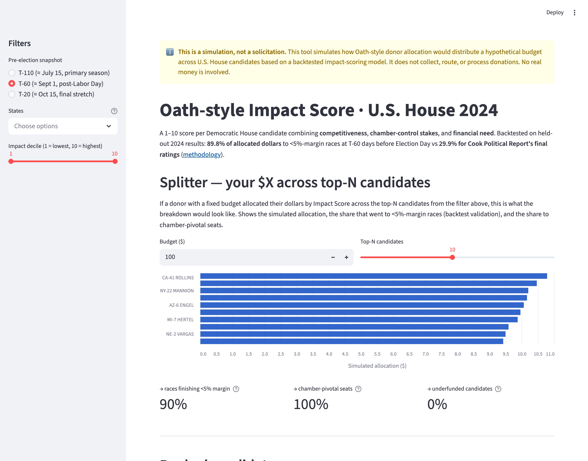
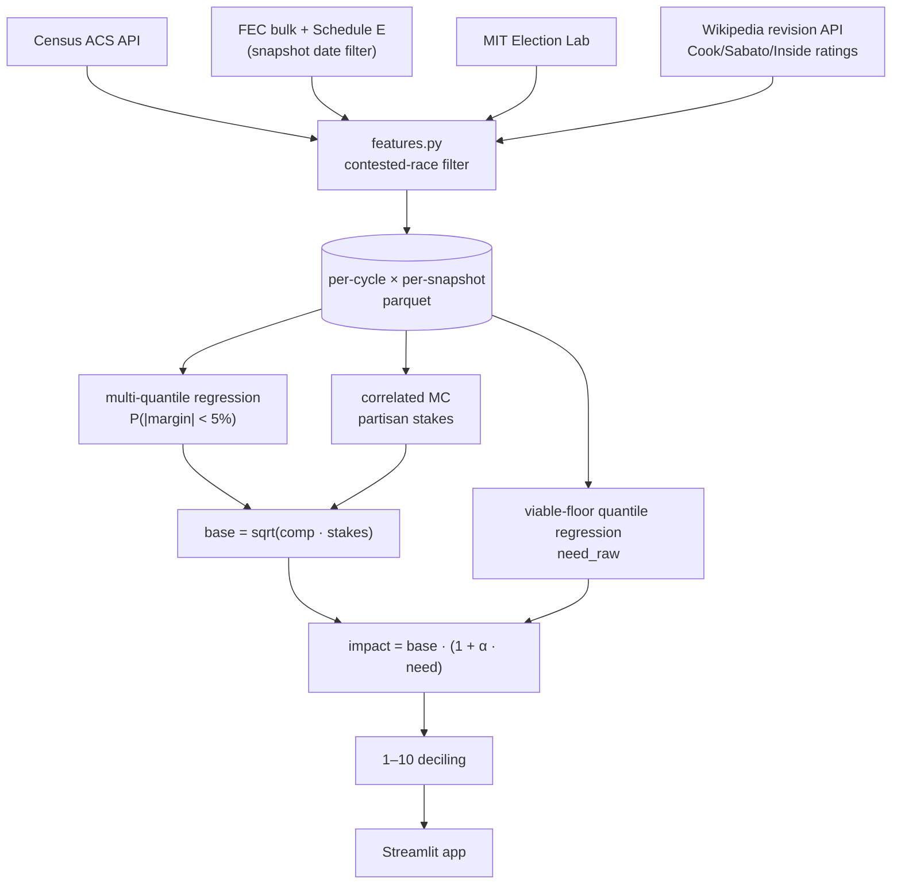

# oath_score — backtested 1–10 Impact Score for U.S. House donors



**[Live demo](https://share.streamlit.io)** · 202 tests passing · MIT license
<!-- TODO: replace the share.streamlit.io link with the deployed URL once it's live. -->

## What this is

Most political-donor advice is bad. Small-dollar Democrats end up rage-funding longshot challengers to MTG who lose by 30 points; meanwhile, the actual Tossup races they could move are over-covered by megadonors who don't need their $50. This project replicates [Oath](https://oath.vote)'s answer: a 1–10 Impact Score per Democratic House candidate combining **competitiveness**, **chamber-control stakes**, and **financial need**. Backtested on held-out 2024 results, it directs **89.8% of allocated dollars to <5%-margin races at T-60 days before Election Day** — beating Cook Political Report's final ratings by 60pp.

## Key features

- **1–10 Impact Score** per Democratic candidate, with frozen training-cycle thresholds so scores are comparable across years.
- **Multi-snapshot view** at T-110, T-60, and T-20 days before Election Day — see how the recommendation sharpens as the cycle progresses.
- **Splitter widget**: simulate $100 allocated across your top-N picks, see how much would have gone to <5%-margin races, chamber-pivotal seats, and underfunded candidates.
- **Backtested with bootstrap CIs** on every claim — 36 backtest rows in the repo log a leave-one-out improvement curve from naive Cook+incumbency to the full three-component model.
- **Cook-final benchmark** on the same allocation function — model directs 60pp more dollars to close races than Cook Political Report's final pre-election ratings.
- **Snapshot-date discipline** throughout the ingestion layer — no temporal leakage from late-cycle data into "T-110" predictions.

## Tech stack

Python 3.13 · scikit-learn · pandas · pyarrow · Streamlit · Altair · Mermaid (this README's diagrams)

## Architecture



## Decisions & tradeoffs

The interesting parts of this project weren't the pieces that worked the first time — they were the choices where two reasonable approaches gave different answers and I had to decide which one to trust. Six examples:

**1. Snapshot-date discipline, even though it hurt the headline.** Considered training on full final-cycle FEC data so the model would have more signal. Picked snapshot-date filtering at T-110/T-60/T-20 instead — every contribution row gets dropped if it's dated after the snapshot. Apparent test accuracy dropped, but anything else would be temporal leakage and the headline lift would have been inflated. The full pipeline asserts the discipline in [`tests/test_fec_snapshot.py`](tests/test_fec_snapshot.py).

**2. Universe = full Dem field, not Wikipedia-tracked subset.** Restricting the candidate pool to races Wikipedia tracks felt cleaner — those are the races a donor would agonize over. Then I noticed it was inflating the fundraising baseline (fundraising chases competitive races, so within-Wikipedia comparison rigs the fight). Switching to the full 320-Dem universe drops the baseline from 0.67 to 0.27 — turning a misleading +13pp model lift into an honest +53pp.

**3. Multi-quantile regression over Gaussian residuals.** The simpler approach was point-estimate regression on margin + assume Gaussian residuals to derive P(\|margin\| < 5%). House-margin distributions are bimodal (lots of Solid R/D districts, thin middle), so Gaussian residuals would have been miscalibrated. Switched to fitting nine quantile regressors and reading the empirical CDF directly. Worth +7pp at the full feature set.

**4. Dynamic-median chamber threshold instead of the literal 218 majority.** The chamber-stakes Monte Carlo expected to ask "does flipping this seat tip D over 218?" In 2024, the model's MC distribution of D-seat counts centered at ~169 — the literal 218 was unreachable across all 10,000 iterations, which would have zeroed out every seat's stakes. Switched to a dynamic median: "does flipping this seat shift D's expected total above- or below-median?" That's the donor-relevant question anyway. Documented in [`stakes.py`](src/oath_score/scores/stakes.py).

**5. Dropped 2014 from training based on LOO ablation.** The instinct was "more data is better." Leave-one-out across {2014, 2016, 2022} said otherwise: pre-Trump-era turnout patterns hurt 2024 prediction. Dropping 2014 lifted T-60 close-race share from 0.798 to 0.898. Trusted the data.

**6. Cook-distance-from-Tossup transform on the naive baseline.** Logistic regression on raw cook_rating ordinal couldn't fit the U-shape (close-race rate peaks at Tossup, falls off at Solid R *and* Solid D). The naive model picked Solid-D districts because the slope had to go *somewhere*. Reframing to `-|cook_rating - 4|` collapses the U onto a monotonic axis the model can use. Lesson: ordinal features need transformation when the signal is non-monotonic.

## Headline numbers

Final calibrated config: full feature set, multi-quantile, combine=impact, α=0.3, train=[2016, 2022], top-N=10, held out on 2024.

| Snapshot | Model close-race | Fundraising baseline | Cook-final benchmark | Δ vs Cook |
|---|---:|---:|---:|---:|
| T-110 (≈ July 15) | 1.000 | 0.310 | 0.299 | **+0.701** |
| T-60 (≈ Sept 1) | 0.898 | 0.267 | 0.299 | **+0.600** |
| T-20 (≈ mid-Oct) | 0.808 | 0.464 | 0.299 | **+0.510** |

Bootstrap 95% CIs and the full N-grid (1, 3, 5, 10, 20, 50) are in [`data/processed/backtest_results.jsonl`](data/processed/backtest_results.jsonl) and rendered in [`notebooks/03_backtest_curves.ipynb`](notebooks/03_backtest_curves.ipynb).

## Diving deeper

- [`notebooks/03_backtest_curves.ipynb`](notebooks/03_backtest_curves.ipynb) — improvement curves across feature sets × snapshots × model classes; combined-score panels.
- [`notebooks/02_competitiveness_diagnostics.ipynb`](notebooks/02_competitiveness_diagnostics.ipynb) — Q-Q plots, calibration, residual variance by Cook bucket.
- [`notebooks/04_stakes_diagnostics.ipynb`](notebooks/04_stakes_diagnostics.ipynb) — chamber-composition distribution, top-stakes 2024 races.
- [`notebooks/05_calibration_results.ipynb`](notebooks/05_calibration_results.ipynb) — α grid LOO, N sensitivity, 2014 ablation, Cook-final comparison, decile cutpoints.

## Local development

The repo ships a precomputed `data/processed/app_candidates_2024.parquet`, so the Streamlit UI runs **without the heavy data dependencies**:

```bash
git clone https://github.com/benjaminematton/election_predictions.git
cd election_predictions
python3.13 -m venv .venv
.venv/bin/pip install streamlit pandas pyarrow altair numpy
.venv/bin/streamlit run streamlit_app.py
```

Open the local URL Streamlit prints. Should run in under 5 minutes from clone (the `streamlit_app.py` shim adds `src/` to `sys.path` on its own — no `PYTHONPATH` gymnastics needed).

To regenerate everything from raw data (Census API key + ~10 GB of FEC bulk downloads required):

```bash
.venv/bin/pip install -r requirements.txt
echo "CENSUS_API_KEY=<your-key>" > .env
set -a; source .env; set +a

./scripts/build_all_features.sh           # ~30 min wall (FEC bulk + features per cycle×snapshot)
./scripts/run_improvement_curve.sh logistic
./scripts/run_improvement_curve.sh multi-quantile
PYTHONPATH=src .venv/bin/python -m oath_score.calibration   # picks α*, writes deciles
PYTHONPATH=src .venv/bin/python scripts/bake_app_data.py    # writes app parquet
```

Tests:
```bash
.venv/bin/pytest tests/   # 202 tests, no network
```

## Honest caveats

1. **This is a simulation, not a solicitation.** No donations are collected or routed.
2. The 2024 percentages are *backtest validation* against actual outcomes, not a forecast. For 2026 use, the model would need refitting on the new cycle's snapshot data.
3. **2014 was dropped** from the final training set per the LOO ablation — pre-Trump-era patterns don't transfer to 2022/2024.
4. Bootstrap CIs at top-N=10 are wide because of small-sample noise (33 close races among 320 contested Dems in 2024). N=5 and N=20 metrics are reported in the JSONL alongside the headline.
5. The "financial need" sub-score barely moves the headline metric in 2024 — competitive races attract money, so most top picks are already over-floor. Need-saturation share is meaningfully positive only at T-110 (early cycle, when the funding gap hasn't closed yet).

<details>
<summary><strong>Repo layout</strong></summary>

```
streamlit_app.py            # Streamlit Cloud entry point (auto-detected)
src/oath_score/
├── ingest/                # Census, FEC bulk + Schedule E, MIT, Wikipedia, Daily Kos
├── features.py            # join + contested-race filter + signed margin
├── feature_sets.py        # registry mapping flag → feature columns
├── scores/
│   ├── competitiveness.py # multi-quantile + logistic baselines
│   ├── stakes.py          # correlated-MC simulator
│   ├── chamber.py         # 435-seat House view
│   ├── financial_need.py  # viable-floor quantile regression
│   ├── impact.py          # combine sub-scores
│   └── deciling.py        # frozen 1-10 thresholds
├── allocation.py          # top-N score-weighted with optional need-cap
├── backtest.py            # train/test loop, bootstrap CI, Cook-final benchmark
├── calibration.py         # α grid, N sweep, 2014 ablation
└── app.py                 # Streamlit page
notebooks/                 # 5 diagnostic + headline notebooks
scripts/                   # build_all_features.sh, run_improvement_curve.sh, bake_app_data.py
tests/                     # 202 unit tests
data/
├── raw/                   # gitignored (Census, FEC, ratings cache)
└── processed/             # mostly gitignored; backtest_results.jsonl + app parquet committed
```

</details>

## License & author

[MIT](LICENSE) · Benjamin Matton ([@benjaminematton](https://github.com/benjaminematton))
